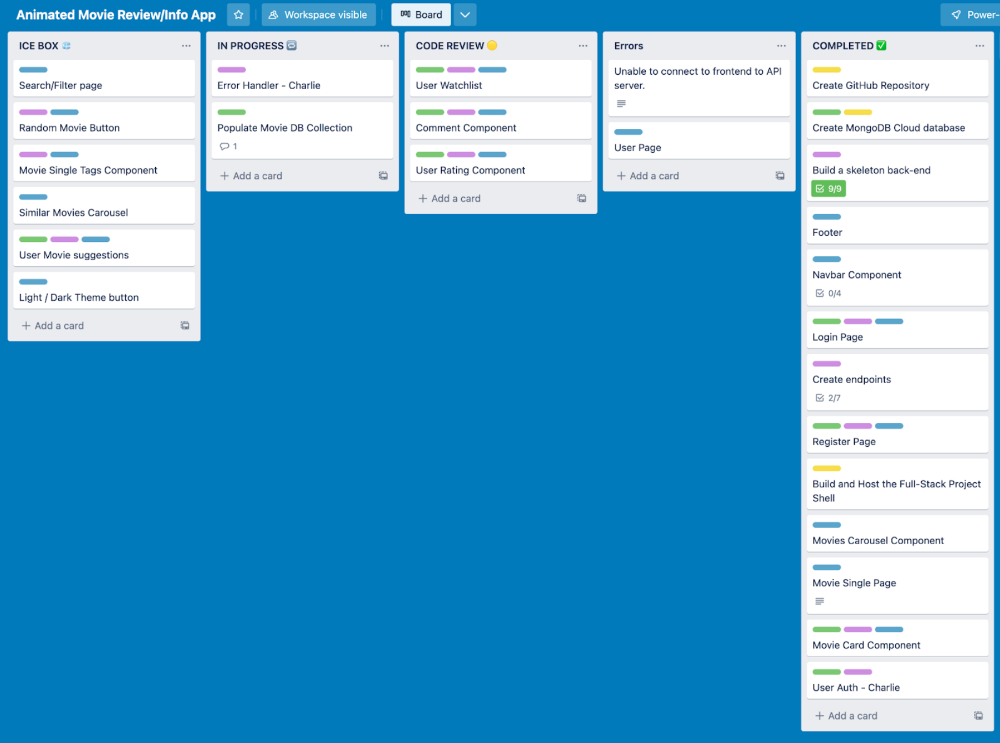

# GA SEI Project 3 - Animovies

**Project Link:** https://animovies-ga.netlify.app/

## Overview

This project was completed in fulfilment for the project 3 full-stack application assignment on General Assembly’s Software Engineering Immersive course. The project was a collaborative assignment working with two other developers and involved building a full-stack JavaScript application using the MERN stack. The project app is called ‘Animovies’ and resembles an IMDB-type movie information app for animated movies that allows users to search their favourite animated movies, watch movie trailers and register/login to add movies to their watchlist to remind them to watch later. The development of the project included first planning exactly what needed to be done and by whom. Following this the process of coding the MVP took place, then we worked towards achieving our stretch features. Lastly the project was deployed using Netlify and Heroku and is available to visit via the project link.

**Timeframe:** 7 days | Group

**Other Developers:**

- Fasai Chunchuasuparerk: https://github.com/fasaic
- Ridwan Arshad: https://github.com/Riddles-sys

## Tech used:

- **Frontend:** HTML, CSS, JavaScript, React, Bootstrap, SASS, Axios, Insomnia
- **Backend:** Node.js, Express.js, Mongoose, JWT, Bcrypt, MongoDB
- **Other:** Figma, Trello, Excalidraw, Netlify, Heroku

## Planning process

After initially settling on what we wanted to build as a group, we then started to plan out the project by establishing what needed to be done and exactly who in the group was doing what. Some tasks could be done by only one solo group member but other development tasks would benefit from a collaborative effort of all group members. This was due to either the difficulty of the task or that the knowledge gained from completing such task would be helpful in building out other features of the project. Displayed below is the workflow for the project which shows the first 4 tasks that we decided to complete before we asked for signoff. Following that, see tasks 5 - 13 which show the post-planning stages of the project where we began by creating repos for the frontend and backend, setting up the MongoDB database. Then, basic project shells were created which then allows each group member to work on individual features or components.

The screenshot below is an overview of the project pages wireframing which displays, from left to right, the landing page with several rows of content carousels defined by movie genre that include clickable movie cards. Next we have the movie search and filter page where users can search for a movie by name or filter by movie tags or genres which displays all the movies that meet the search/filter conditions. On the next right the movie single page is displayed which shows the movie information, youtube trailer, poster, actors, description and rating. This page also displays the add to watchlist button at the top of the page and the comments sections below the movie information. The last two pages on the right show the register and login pages which simply display the relevant forms and required inputs for collection of user data with also form submission buttons.

Another diagram created as part of the planning process established exactly what components and code files we needed to build separated into frontend and backend. The frontend component diagram shows the global files, global components used throughout the app, page components used on individual pages, and styles used on each page or component. As for the backend components, these can be separated into global files, controllers, models, utils and middleware.

## Coding

After the planning of the project was completed and the workflow of the project was established and development tasks were delegated, the coding began. We used a Trello board to manage our progress in the development of our app. As displayed in the Trello board below, each feature or component is added to a card with coloured tags relating to its relevance and categorised in the titled groups based on its status. This was a critical tool as it allowed us to know exactly what each developer was working on at any time and helped to reduce any conflicts when it became time to merge feature branches.

My contributions to the project in terms of writing code and building components/features involved creating the general file structure and setting up the routing on the frontend. Another contribution was adding the user authentication to the app by writing both frontend and backend logic and using the Bcrypt and JWT packages. Lastly, I also built out the user watchlist by similarly writing the full-stack logic for the feature. Although each of the group members did work on their own individual components or features, we did also collaborate throughout the project whenever needed which could often happen when fixing bugs or even if one developer is finding something difficult and just needs a fresh perspective. This collaborative coding would often take the style of pair programming and would often be really beneficial to our progress.

## Featured Code Snippet - Movie Watchlist

The code snippet displayed below shows Express.js code written in the Node.js back-end runtime environment and depicts the logic for the user’s watchlist feature. This feature allows users to add and remove movies to their own watchlist. As we can see the logic is separated into three functions of getWatchlist, addToWatchlist, and removeFromWatchlist. The getWatchlist function is called when a user visits their watchlist page on the frontend which triggers a get request and calls the function. The function then searches the DB using the current user's id which was sent in the parameters of the get request. If the user has been identified the user's watchlist data is returned back and mapped onto the watchlist page, though if the user’s id is incorrect or not sent in the get request then an error message is returned.
The addToWatchlist function is triggered onclick of the add to watchlist button of the individual movie pages and sends a get request calling the function. Once called the function will find the movie and the user from the DB based on the movieId and userId sent in the request params. If these conditions are met then the specified movie will be added to the watchlist array of the specified user and the user’s new data is saved to update the db and a success status is returned. If the conditionals are not met then an error message will be returned.
Finally, the last function does the opposite of the previous function by removing a movie from the users watchlist. This function is called when the user clicks the x button to remove the movie from their watchlist. Once called the function will similarly identify the specified movie and current user from the id in the request parameters. After this the user’s watchlist is filtered to remove the specified movie, then the watchlist is saved to update the db with the new user data.

The frontend for the user watchlist feature is displayed below and shows the hover animation which allows the user to remove the movie from their watchlist when clicked.

## Project Wins

- Working with React on the frontend for the second time on a project went well I thought as I felt quite comfortable writing the code after having previous experience.
- Collaboratively worked on a full-stack project to develop a web app and backend system that stores information on animated movies and dynamically displays this information to the frontend. Users can also register/login with the app to leave reviews on movies they have watched or view trailers and add movies to their user watchlist as a reminder to watch later.
- Initially the project UI design, app architecture, database schemas were decided on as a group, then individual feature components were delegated to each developer. My contributions involved developing the user authentication, user watchlist feature which had me regularly working on both the frontend and backend of the app.
- Working collaboratively with other developers over zoom went great as we all got on very well together as we had clearly defined tasks and responsibilities for each developer. Further, using GitHub branches to manage our code went surprisingly smoothly for our first time using them.

## Challenges / Bugs

- We initially encountered a bug with removing items from the user watchlist. Despite the request to delete items coming through to the backend, the items on a user's watchlist did not change. However, after some time we realsied that the schema for this data was incorrect and needed to be edited from an object to an array so that items could be easily added or removed.

## What did I learn?

- Gained useful experience working with other developers by using GitHub branches to work on individual features, then reviewing pull requests and performing merges on branches.
- The project represented a lot of firsts for my own personal development as it was my first time working on a full-stack app and the first time collaborating with other developers. I feel like it was quite a change from solo developing but I think that I gained valuable experience from working on this project.

## Future Improvements

- One of the stretch goals which we didn't quite manage was to add a ‘similar movies’ carousel on the single movie pages. This would display movies that would be the same genre or have the same tags as the movie on the current page.
- Another would be to have a Light/Dark theme for the web app that would have a button on the nav bar to easily switch between the two themes. This would be a simple improvement but due to time constraints we didn't manage to build it.
- One of the larger stretch goals we came up with was to have a personalised movie recommendation carousel where users would be recommended movies based on other movies they have previously liked.
