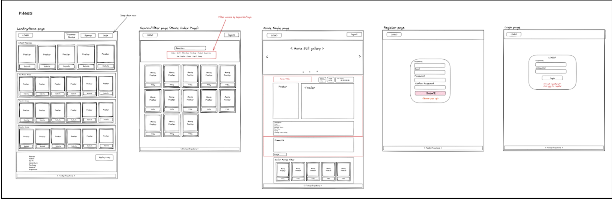

# GA SEI Project 3 - Animovies

**Project Link:** https://animovies-ga.netlify.app/

## Overview

This project was completed in fulfilment for the project 3 full-stack application assignment on General Assembly’s Software Engineering Immersive course. The project was a collaborative assignment working with two other developers and involved building a full-stack JavaScript application using the MERN stack. The project app is called ‘Animovies’ and resembles an IMDB-type movie information app for animated movies that allows users to search for their favourite animated movies, watch movie trailers, and register/login to add movies to their watchlist to remind them to watch later. The development of the project included first planning exactly what needed to be done and by whom. Following this the process of coding the MVP took place, then we worked towards achieving our stretch features. Lastly, the project was deployed using Netlify and Heroku and is available to visit via the project link.

**Timeframe:** 7 days | Group

**Other Developers:**

- Fasai Chunchuasuparerk: https://github.com/fasaic
- Ridwan Arshad: https://github.com/Riddles-sys

## Tech used:

- **Frontend:** HTML, CSS, JavaScript, React, Bootstrap, SASS, Axios, Insomnia
- **Backend:** Node.js, Express.js, Mongoose, JWT, Bcrypt, MongoDB
- **Other:** Figma, Trello, Excalidraw, Netlify, Heroku

## Planning process

After initially settling on what we wanted to build as a group, we then started to plan out the project by establishing what needed to be done and exactly who in the group was doing what. Some tasks could be done by only one solo group member but other development tasks would benefit from a collaborative effort of all group members. This was due to either the difficulty of the task or the knowledge gained from completing the task would be helpful in building out other features of the project. Displayed below is the workflow for the project which shows the first 4 tasks that we decided to complete before we asked for signoff. Following that, see tasks 5 - 13 which show the post-planning stages of the project where we began by creating repos for the frontend and backend, and setting up the MongoDB database. Then, basic project shells were created which then allows each group member to work on individual features or components.

The screenshot below is an overview of the project wireframing which displays, from left to right, the landing page with several rows of content carousels defined by movie genre that include clickable movie cards. Next, we have the movie search and filter page where users can search for a movie by name or filter by movie tags or genres which displays all the movies that meet the search/filter conditions. On the next right, the movie single page is displayed which shows the movie information, youtube trailer, poster, actors, description, and rating. This page also displays the add to watchlist button at the top of the page and the comments sections below the movie information. The last two pages on the right show the register and login pages which simply display the relevant forms and required inputs for the collection of user data with also form submission buttons.

Another diagram created as part of the planning process established exactly what components and code files we needed to build separated into frontend and backend. The frontend component diagram shows the global files, global components used throughout the app, page components used on individual pages, and styles used on each page or component. As for the backend components, these can be separated into global files, controllers, models, utils, and middleware.

## Coding

After the planning of the project was completed and the workflow of the project was established and development tasks were delegated, the coding began. We used a Trello board to manage our progress in the development of our app. As displayed in the Trello board below, each feature or component is added to a card with coloured tags relating to its relevance and categorised in the titled groups based on its status. This was a critical tool as it allowed us to know exactly what each developer was working on at any time and helped to reduce any conflicts when it became time to merge feature branches.

My contributions to the project in terms of writing code and building components/features involved creating the general file structure and setting up the routing on the frontend. Another contribution was adding the user authentication to the app by writing both frontend and backend logic and using the Bcrypt and JWT packages. Finally, I also built out the user watchlist by similarly writing the full-stack logic for the feature. Although each of the group members did work on their own individual components or features, we did also collaborate throughout the project whenever needed which could often happen when fixing bugs or even if one developer is finding something difficult and just needs a fresh perspective. This collaborative coding would often take the style of pair programming and would often be beneficial to our progress.

## User Authentication

**User model**

The user authentication is a key component in this project as it allows users to register with a username, email, and password which they can use to login and have access to the site's main features. This means logged-in users have permission to submit ratings and comments on movies while also being able to add and remove movies from their user watchlist. The user authentication logic is probably some of the most complex pieces of code in the project as it connects with so many other features.

In creating the user auth, I first created a DB model for the user data. This involved creating a user.js file inside the models folder in the backend repository. This file would essentially tell the database exactly what the user’s data would look like. This is shown in the code snippet below which displays the userSchema which establishes the type of data that would be stored, which in this instance would be either a string, number, or date. Though, some of the object keys have the value of an array. This is because this value will likely be manipulated in the future by adding or removing items. Also, the userSchema shows if the specific data keys are required or if they need to be unique values.

**Auth.js Middleware**

The next step in the user auth development was to create a middleware which is displayed in the code snippet for the auth.js file below. This shows the user model being imported at the top of the page and used in conjunction with the imported JsonWebToken package to determine if a user request has been sent with an access token. The code shows the token being decoded from the request headers and checked against the user database in MongoDB. If the token is a match then the user is authorised and the request is processed. However, if either no token is sent or the token has expired, an error status will return with the corresponding error message. This middleware logic is exported as it is used in many of the backend components to authorise when a user needs to interact with the backend by sending a request.

**userController**

The biggest piece of code that makes up the user authentication system would be the userController. The logic in this file allows users to send requests and receive responses to and from the backend system and the database with the help of API endpoints. This file is split into three separate code snippets below which each perform a different task.

The first snippet shows the logic for when a new user sends a request to the backend to register their details into the database. The logic chain for this snippet is as follows: user request is sent to the backend, and the new user data is received from the request body and is checked against the database to determine if a user with the same email address already exists. If this email address is already in use by a current user an error status and message are returned. The same check is completed with the new user’s username. If both the new user’s email and username are unique the code will then check to see if the new user’s password and confirmPassword match, if not an error is returned. Once these checks are completed and passed, the user’s password is encrypted with the help of Bcrypt and the user is created and added to the user database in MongoDB with a success status returned to the frontend.

The next code snippet displays the logic to perform the logging-in of the user. When a user sends a login request to the backend, the code will get the userName and password data from the request body. This data is then used to find the user in the user database. If no user is found or the user details are incorrectly inputted, then an error status and message are returned. If a user is successfully found then a payload is created with the user’s details. This payload is used in combination with the JWT secret to create a JWT token which is returned to the user providing them with authentication to sign in and allowing access to various protected routes on the website.

The last snippet of the userController shows the logic for when a signed-in user accesses their user profile page. The chain of logic is as follows: user request is sent to the backend and is fielded by this function. This function gets the user id from the request and uses the id to find the user in the database. Once found the user’s information that’s stored in the user database is simply returned and displayed on the frontend. However, if the user is not found in the database then an error status and message are returned.

**Router.js**

Much of the code in the snippets previously explained is connected in the Router.js file which establishes the API endpoints and specifies the paths and the types of requests. Displayed in the first code snippet below we have the authentication routes, which allow the user to send data to the backend server by using a post request. This request is sent with the relevant data and is fielded by the logic written in the userController.

This second code snippet is also from the router.js file and displays a protected route that uses the auth.js middleware to only allow authorised users to access this route. In the code below this route is used to request user data from the database to then be displayed on a user profile page on the frontend.

## Movie Watchlist

The code snippet displayed below shows Express.js code written in the Node.js back-end runtime environment and depicts the logic for the user’s watchlist feature. This feature allows users to add and remove movies to their watchlists. As we can see the logic is separated into three functions of getWatchlist, addToWatchlist, and removeFromWatchlist. The getWatchlist function is called when a user visits their watchlist page on the frontend which triggers a get request and calls the function. The function then searches the DB using the current user's id which was sent in the parameters of the get request. If the user has been identified the user's watchlist data is returned and mapped onto the watchlist page, though if the user’s id is incorrect or not sent in the get request then an error message is returned.

The addToWatchlist function is triggered on click of the add to watchlist button of the individual movie pages and sends a get request calling the function. Once called the function will find the movie and the user from the DB based on the movieId and userId sent in the request params. If these conditions are met then the specified movie will be added to the watchlist array of the specified user and the user’s new data is saved to update the DB and a success status is returned. If the conditionals are not met then an error message will be returned.

Finally, the last function does the opposite of the previous function by removing a movie from the user's watchlist. This function is called when the user clicks the x button to remove the movie from their watchlist. Once called the function will similarly identify the specified movie and current user from the id in the request parameters. After this the user’s watchlist is filtered to remove the specified movie, then the watchlist is saved to update the DB with the new user data.

The frontend for the user watchlist feature is displayed below and shows the hover animation which allows the user to remove the movie from their watchlist when clicked.

## Who did what?

The project involved group collaboration in most of the components/features built but some tasks we would purposefully work on as a group and sometimes we would break off and work on something individually. The initial setup of the project repo, creating the file layout, and installing packages that we would use on the project was done as a group. This was important to do collaboratively as it would help us later on in development if we all knew the file structure very well.

As for the individual tasks, to my knowledge, Ridwan worked on setting up, seeding, and maintaining the MongoDB database for the project. This also involved populating the database with movie data. Ridwan in collaboration with Fasai also worked on building some of the frontend functionality for the movie search and filter feature and the movie genre carousel components. Further, Fasai worked on quite a lot of the frontend for this project and was responsible for much of the styling and UI having done a very detailed Figma mockup to lead her frontend development. The logic for the parts of the project developed by Ridwan and Fasai is not talked about in detail in this ReadMe but if you are interested in the pages/components they worked on I would suggest taking a look at their project ReadMes which are linked at the top of the page.

As for myself, my contributions to the project were in the development of the user authentication system building both the backend and also part of the frontend auth along with teamwork from Fasai and Ridwan. I also worked individually on the user watchlist functionality and developed the feature writing both the backend and frontend code.

## Project Wins

- Working with React on the frontend for the second time on a project went well I thought as I felt quite comfortable writing the code after having previous experience.
- Collaboratively worked on a full-stack project to develop a web app and backend system that stores information on animated movies and dynamically displays this information to the frontend. Users can also register/login with the app to leave reviews on movies they have watched or view trailers and add movies to their user watchlist as a reminder to watch later.
- Initially, the project UI design, app architecture, and database schemas were decided on as a group, then individual feature components were delegated to each developer. My contributions involved developing the user authentication, and user watchlist feature which had me regularly working on both the frontend and backend of the app.
- Working collaboratively with other developers over zoom went great as we all got on very well together as we had clearly defined tasks and responsibilities for each developer. Further, using GitHub branches to manage our code went surprisingly smoothly for our first time using them.

## Challenges / Bugs

- We initially encountered a bug with removing items from the user watchlist. Despite the request to delete items coming through to the backend, the items on a user's watchlist did not change. However, after some time we realsied that the schema for this data was incorrect and needed to be edited from an object to an array so that items could be easily added or removed.
- The ‘add to watchlist’ button needs to be disabled after a user has clicked it once. Currently, it can be clicked repetitively which adds the same movie to the user watchlist and does not give a good user experience. After some failed attempts at writing a solution to fix this problem, we had to leave it due to time constraints but it’s on my list to fix.
- When a signed in user adds a new comment to a movie the page reloads to display the comment. This is not very professional as it doesn't give a good user experience. This was not fixed due to time constraints but can be fixed in the future.

## What did I learn?

- Gained useful experience working with other developers by using GitHub branches to work on individual features, then reviewing pull requests and performing merges on branches.
- The project represented a lot of firsts for my personal development as it was my first time working on a full-stack app and the first time collaborating with other developers. I feel like it was quite a change from solo development but I think that I gained valuable experience from working on this project.

## Future Improvements

- One of the stretch goals which we didn't quite manage was to add a ‘similar movies’ carousel on the single movie pages. This would display movies that would be the same genre or have the same tags as the movie on the current page.
- Another would be to have a Light/Dark theme for the web app that would have a button on the nav bar to easily switch between the two themes. This would be a simple improvement but due to time constraints, we didn't manage to build it.
- One of the larger stretch goals we came up with was to have a personalised movie recommendation carousel where users would be recommended movies based on other movies they have previously liked.
